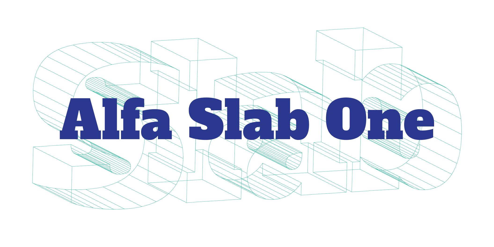

### Introduction

Alfa Slab One is based on William Thorowgood’s brilliantly quirky 6-Line Pica Egyptian cut in the early 19th century. It is a contemporary interpretation developed to serve as a robust display face for headlines and captions on screens. 

Design by JM Solé

### Language Support

**WIP**

### OpenType Support

**WIP**
